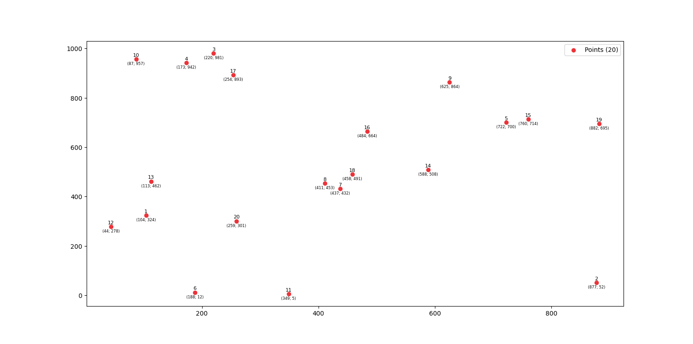
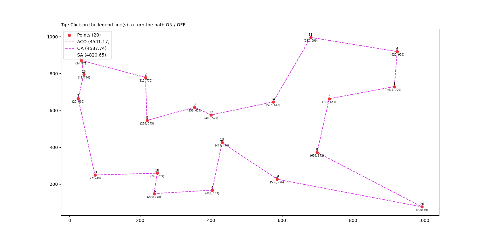
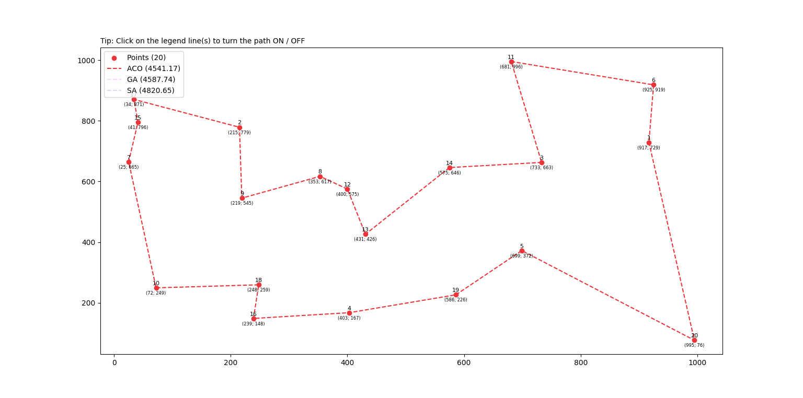
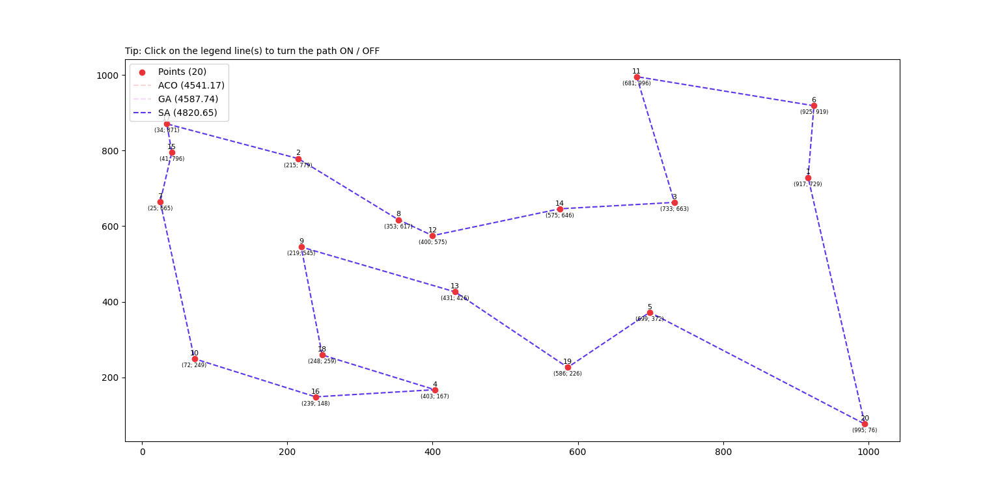

# Travelling Salesman Problem


## О задаче
Задача коммивояжёра (Travelling Salesman Problem, TSP) — задача комбинаторной оптимизации. Как правило, её суть сводится к поиску оптимального пути, проходящего через все промежуточные пункты по одному разу и возвращающегося в исходную точку.



## Метаэвристические алгоритмы
Метаэвриистика — метод оптимизации, многократно использующий простые правила для достижения субоптимального решения. В данной статье мы рассмотрим следующие алгоритмы решения задачи:
1. **Генетический алгоритм** (Genetic Algorithm, GA), относящийся к
классу эволюционных методов;
2. **Муравьиный алгоритм** (Ant Colony Optimization, ACO), относящийся
к классу методов "роевого" интеллекта;
3. **Алгоритм имитации отжига** (Simulated annealing, SA), относящийся к
классу методов, имитирующих физические процессы.

### Генетический алгоритм
Генетический алгоритм — алгоритм поиска, используемый для решения задач оптимизации и моделирования путём случайного подбора, комбинирования и вариации искомых параметров с использованием механизмов, аналогичных естественному отбору в природе.

[Файл GA.py](problem/algorithms/GA.py)

Гиперпараметры:
* ```population``` — общее число особей, участвующих в одной итерации;
* ```iter``` — максимальное количество итераций алгоритма;
* ```s``` — определяет, сколько лучших особей попадет в следующую популяцию (в процентном соотношении);
* ```m``` — определяет, как часто особи в популяции мутируют (в процентном соотношении).



### Муравьиный алгоритм
Муравьиный алгоритм — один из эффективных алгоритмов для нахождения приближённых решений задачи коммивояжёра, а также решения аналогичных задач поиска маршрутов на графах. Суть подхода заключается в анализе и использовании модели поведения муравьёв, ищущих пути от колонии к источнику питания.

[Файл ACO.py](problem/algorithms/ACO.py)

Гиперпараметры:
* ```ants``` — общее количество агентов (муравьев), задействованных в одной итерации;
* ```iter``` — максимальное количество итераций алгоритма;
* ```α``` — коэффициент, контролирующий влияние феромона на ребре;
* ```β``` —коэффициент, контролирующий влияние привлекательности маршрута (величина, обратно пропорциональная длине маршрута);
* ```ρ``` — коэффициент испарения феромона, который отражает степень взаимного влияния между муравьями, как правило, значение равно [0, 1], что предотвращает бесконечное накопление феромона;
* ```q``` — интенсивность феромона, которая представляет собой общее количество феромонов, в определённой степени влияет на скорость сходимости алгоритма.



### Алгоритм имитации отжига
Алгоритм имитации отжига — метод решения задачи глобальной оптимизации. Он основывается на имитации физического процесса, который происходит при кристаллизации вещества, в том числе при отжиге металлов. Предполагается, что в определённый момент атомы вещества практически выстроены в кристаллическую решётку, но ещё допустимы переходы отдельных атомов из одной ячейки в другую. Активность атомов тем больше, чем выше температура, которую постепенно понижают, что приводит к тому, что вероятность переходов в состояния с большей энергией уменьшается. Устойчивая кристаллическая решётка соответствует минимуму энергии атомов, поэтому атом либо переходит в состояние с меньшим уровнем энергии, либо остаётся на месте.

[Файл SA.py](problem/algorithms/SA.py)

Гиперпараметры:
* ```iter``` — максимальное количество итераций алгоритма;
* ```t``` — начальная температура поиска, уменьшается по мере продвижения поиска;
* ```g``` — коэффициент, влияющий на изменение температуры.




## Использование

Установка требуемых зависимостей:
```pip install -r requirements.txt```

Требуемые зависимости:
* numpy==1.25.2
* matplotlib==3.7.2

Подробнее ознакомиться с кодом данных алгоритмов и поэкспериментировать с подбором гиперпараметров можно [здесь](problem/usage.py).

## Контакты
Если вы хотите помочь в разработке или у вас есть вопросы, вы можете связаться с создателем репозитория ([@rand0lphc](https://t.me/rand0lphc)) в telegram.